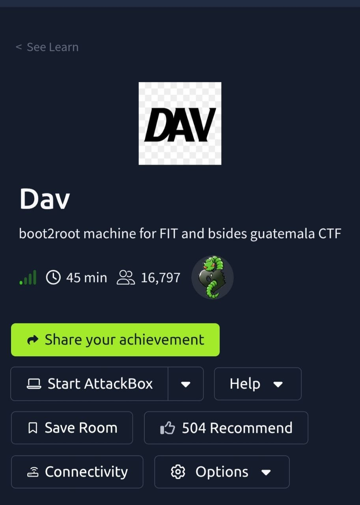

<p align="center">
  
</p>
# Machine Information

- **Machine Name**: Dav
- **Platform**: TryHackMe
- **Difficulty**: Easy
- **Topics Covered**: Web Enumeration, WebDAV Exploitation, Privilege Escalation via Sudo misconfigurations.

---

# Lab Overview
المشين دي عبارة عن تحدي (boot2root) يعني الهدف منها إننا نبدأ من الصفر تماماً لحد ما نوصل لأعلى صلاحية في الجهاز وهي الـ (Root). الفكرة الأساسية هنا بتتمحور حولين ثغرات الـ Web Services وتحديداً الـ WebDAV، وازاي الـ Misconfigurations أو الإعدادات الغلط وسوء إدارة الصلاحيات ممكن تفتح باب للمهاجم إنه يسيطر على السيرفر بالكامل.

---

# Initial Enumeration

# Phase 1: Network Scanning

## Execution Parameters
```bash
nmap -sV -Pn 10.128.178.197

```

## Evidence & Outputs

## Technical Analysis

* **Findings**: البورت `80/tcp` مفتوح، وشغال عليه ويب سيرفر من نوع `Apache httpd 2.4.18` على نظام تشغيل `Ubuntu`.
* **Impact**: بما إن بورت 80 هو بورت الـ HTTP الافتراضي، ده معناه إن عندنا موقع ويب شغال وجاهز إننا ندرسه ونفحصه .
* **Assessment & Conclusions**: الـ Scan مطلعش أي بورتات تانية مفتوحة ومثيرة للاهتمام، يبقى بنسبة 100% مدخلنا للمشين دي هيكون عن طريق تطبيق الويب (Web Application).

## Alternative Attack Vectors

* **Rustscan**: بديل سريع جداً بيكسب وقت في الفحص.
* **Masscan**: ممتاز لو بنفحص شبكات ضخمة جداً.

## Next Logical Step

الخطوة المنطقية لأي Pentester بعد ما يلاقي بورت 80 مفتوح، إنه يدخل على المتصفح ويعاين الصفحة الرئيسية يدوياً لمعرفة شكل ونوع الموقع وفحص الكود المصدري.

---

# Web Enumeration

# Phase 2: Source Code Review

## Execution Parameters

*(Manual interaction inside the Web Browser via View Page Source functionality)*

## Evidence & Outputs

## Technical Analysis

* **Findings**: أكواد الـ HTML والـ JS نظيفة وسليمة تماماً ولا تحتوي على أي أخطاء أو تسريبات (No sensitive client-side leaks).
* **Impact**: بيأكد لنا إن المطور مقفل أداؤه كويس في الصفحة دي، وبالتالي مش هنضيع وقت أكتر في التحليل اليدوي الواجهي للملف ده.
* **Assessment & Conclusions**: بما إن الثغرة مش واضحة في السورس كود الظاهري، يبقى أكيد فيه مجلدات مخفية على السيرفر ومحتاجين نكتشفها بالـ Brute-forcing.

## Next Logical Step

الاعتماد على أداة `gobuster` لعمل فحص وتخمين للمجلدات المخفية على السيرفر.

---

# Phase 3: Directory Brute-Forcing

## Execution Parameters

```bash
gobuster dir -u [http://10.128.178.197/](http://10.128.178.197/) -w /usr/share/wordlists/dirb/common.txt

```

## Evidence & Outputs

## Technical Analysis

* **Findings**: الأداة اكتشفت وجود مسار مخفي اسمه `/webdav` وبيرجع كود حالة (HTTP Status: 401 Unauthorized).
* **Impact**: كود `401` معناه إن المجلد موجود ومحمي بصفحة تسجيل دخول (Authentication Wall)، وده مؤشر قوي إن المكان ده جواه صلاحيات مهمة.
* **Assessment & Conclusions**: السيرفر بيستخدم امتداد WebDAV (وهو بروتوكول بيسمح للمستخدمين بتعديل ورفع الملفات على السيرفر). لو قدرنا نكسر تسجيل الدخول ده، غالباً هنقدر نرفع ملفات خبيثة.

## Pentester Rationale

لأن المطورين أو مديري الأنظمة أوقات كتير بيسيبوا لوحات تحكم أو مجلدات خاصة بالعمل دون إخفائها ، والـ Brute-forcing هو الطريقة الوحيدة لاكتشافها.

## Alternative Attack Vectors

* **ffuf** / **Dirbuster** / **Feroxbuster**.

## Next Logical Step

الذهاب للمتصفح وفتح مسار `/webdav` لمعاينة شكل صفحة تسجيل الدخول ودراسة كيفية اختراقها.

---

# Phase 4: HTTP Status Code Validation

## Execution Parameters

*(Manual URL exploration to investigate the structural restrictions of the HTTP 401 error)*

## Evidence & Outputs

## Technical Analysis

* **Findings**: المسار محمي بـ Basic Authentication والنافذة بتطلب اليوزر والباسورد بشكل مباشر.
* **Impact**: ده بيأكد لنا إن الخطوة الجاية هي تخمين الباسورد أو البحث عن الباسوردات الافتراضية للخدمة دي.
* **Assessment & Conclusions**: لا يمكن الوصول لأي ملفات داخل المجلد بدون كسر هذا القفل.

## Pentester Rationale

تأكيد الفرضيات النظرية بشكل عملي عبر المتصفح بيساعد الـ Pentester يفهم نوع الحماية والشكل اللي هيتعامل معاه بدلاً من الاعتماد الكلي على أدوات الـ CLI.

## Alternative Attack Vectors

* **Burp Suite Repeater**: لقراءة الـ Headers وتحليل رد السيرفر بدقة.

## Next Logical Step

محاولة عمل هجوم تخمين (Brute-Force Attack) على نافذة تسجيل الدخول دي.

---

# Vulnerability Analysis

# Phase 5: Online Brute-Force Testing

## Execution Parameters

```bash
hydra -L users.txt -P /usr/share/wordlists/rockyou.txt.gz 10.128.178.197 http-get /webdav

```

## Evidence & Outputs

## Technical Analysis

* **Findings**: القواميس العامة والتقليدية الضخمة منجحتش في كسر الباب ده.
* **Impact**: ده معناه إن الباسورد مش كلمة عادية من الكلمات اللي الناس بتستخدمها، بل ممكن يكون باسوورد افتراضي نزل مع البرنامج نفسه (Default Credentials).
* **Assessment & Conclusions**: لازم نوقف تخمين عشوائي ونبدأ نفكر بشكل ذكي وندور على الإعدادات الافتراضية للـ WebDAV.

## Pentester Rationale

الـ Pentester دايماً بيجرب الحلول السريعة والتخمين الشائع في الأول (Credential Spraying)، لأن لو نجح هيوفر وقت كبير، ولو فشل بيوجهه للطريق الصح.

## Alternative Attack Vectors

* **Medusa** / **Burp Suite Intruder**.

## Next Logical Step

البحث على الإنترنت (OSINT) عن كلمات المرور الافتراضية التي تأتي مع حزم الـ WebDAV الشهيرة.

---

# Phase 6: OSINT & Default Configurations Discovery

## Execution Parameters

*(Passive target intelligence gathering across open-source public code repositories)*

## Evidence & Outputs

## Technical Analysis

* **Findings**: وجود يوزر وباسورد افتراضيين هما `wampp` و `xampp`.
* **Impact**: مديري الأنظمة المبتدئين كتير جداً بينزلوا البرامج ويسيبوها بالإعدادات الافتراضية بدون تغيير، وده بيمثل ثغرة خطيرة جداً (Default Configurations Vulnerability).
* **Assessment & Conclusions**: بنسبة كبيرة جداً التوليفة دي هي اللي هتفتح لنا الباب المحمي.

## Pentester Rationale

البحث الذكي والقراءة دايماً بتوفر مجهود كبير جداً ووقت مقارنة بالتخمين الأعمى الفاشل.

## Alternative Attack Vectors

* **Google Dorking**: استخدام محركات البحث بطرق متقدمة.

## Next Logical Step

تجربة هذه البيانات المكتشفة (`wampp:xampp`) على نافذة تسجيل الدخول في المتصفح بشكل فعلي.

---

# Exploitation

# Phase 7: Authentication Bypass & Permissions Mapping

## Execution Parameters

*(Manual credential injection and remote directory permissions assessment)*

## Evidence & Outputs

## Technical Analysis

* **Findings**: نجاح الدخول وظهور ملف `passwd.dav` اللي جواه الهاش التالي لليوزر: `wampp:$apr1$Wm2VTkFL$PVNRQv7kzqXQIHe14qKA91`.
* **Impact**: ده بيثبت إن السيرفر مصاب بثغرة استخدام إعدادات افتراضية ضعيفة (Default Credentials).
* **Assessment & Conclusions**: بما إننا بقينا جوه مجلد الـ WebDAV، والبروتوكول ده وظيفته الأساسية هي إدارة الملفات، فغالباً السيرفر هيرضى يخلينا نرفع ملفات (Upload Permissions).

## Pentester Rationale

عشان نثبت إن الثغرة حقيقية وقابلة للاستغلال (Exploitable) ونتحرك خطوة للأمام تجاه اختراق النظام.

## Alternative Attack Vectors

* امر `curl` مع إضافة البيانات: `curl --user wampp:xampp http://10.128.178.197/webdav/`

## Next Logical Step

فحص الصلاحيات المتاحة لنا داخل المجلد للتأكد هل مسموح لنا برفع وتشغيل ملفات برمجية (مثل ملفات PHP الخبيثة) أم لا.

---

# Phase 8: Automated WebDAV Auditing

## Execution Parameters

```bash
davtest --help
davtest -url [http://10.128.178.197/webdav/](http://10.128.178.197/webdav/) -auth wampp:xampp

```

## Evidence & Outputs

## Technical Analysis

* **Findings**: السيرفر بيسمح برفع وتشغيل ملفات بامتداد `.php` بشكل كامل وبدون قيود داخل مجلدات تجريبية ينشئها الفحص تلقائياً (مثل `DavTestDir_KciG_tmBc`).
* **Impact**: دي ثغرة قاتلة اسمها (Arbitrary File Upload leading to Remote Code Execution - RCE). طالما بقدر ارفع ملف PHP واخليه يشتغل، فانا أقدر أخليه ينفذ أوامر على السيرفر.
* **Assessment & Conclusions**: نقدر نرفع ملف اتصال عكسي (Reverse Shell) مكتوب بلغة PHP عشان يدينى اختراق مباشر لجهاز الضحية.

## Pentester Rationale

لتوفير الوقت ومعرفة نوع الـ Payload المناسب لبيئة عمل السيرفر وتفادي تجربة ملفات بامتدادات قد تكون محظورة.

## Next Logical Step

تجهيز ملف الـ PHP Reverse Shell وتعديل الإعدادات بتاعته لتشير لجهاز الهاكر بتاعنا.

---

# Gaining Initial Access

# Phase 9: Weaponization & Payload Engineering

## Execution Parameters

```bash
cp /usr/share/webshells/php/php-reverse-shell.php .
ls
ifconfig
mousepad php-reverse-shell.php

```

## Evidence & Outputs

## Technical Analysis

* **Findings**: الـ Payload محتاج تعديل يدوي دقيق لمتغيرات الـ `$ip` والـ `$port`.
* **Impact**: لو الإعدادات دي غلط أو مش بتشير لجهازنا، الشل هيشتغل على سيرفر الضحية ولكن مش هيعرف يوصل لجهازنا، وبالتالي مش هنحصل على الـ Foothold (موطئ القدم).
* **Assessment & Conclusions**: الشل الآن مجهز ومفصل بناءً على شبكتنا وهو جاهز تماماً للرفع والاستغلال.

## Pentester Rationale

تخصيص الـ Payload وتجهيزه وتوجيهه بناءً على الشبكة الحالية (Network Profile Matching).

## Next Logical Step

رفع الملف المجهز إلى السيرفر باستخدام أداة لإدارة وتعديل ملفات WebDAV.

---

# Phase 10: Payload Delivery & Shell Ingestion

## Execution Parameters

```bash
man cadaver
sed -i "s/443/1234/g" myshell.php
cadaver [http://10.130.147.59/webdav/](http://10.130.147.59/webdav/)
# Credentials: wampp / xampp
put myshell.php
exit
sudo nc -nvlp 1234

```

## Evidence & Outputs

## Technical Analysis

* **Findings**: نجاح رفع وتشغيل الملف الخبيث والحصول على اتصال عكسي كامل كأول موطئ قدم (Foothold) بالنظام.
* **Impact**: السيطرة على السيرفر بدأت وأصبحنا قادرين على تنفيذ الكود عن بُعد (Remote Code Execution) داخل السيرفر.
* **Assessment & Conclusions**: يوزر الويب `www-data` صلاحياته محدودة، لذا سنبدأ فوراً بفحص الملفات الداخلية لرفع الصلاحيات.

## Pentester Rationale

استخدام أداة `cadaver` بيسهل عملية التفاعل ورفع الملفات مع بروتوكول WebDAV بشكل مباشر ومنظم وسريع من التيرمنال.

## Next Logical Step

التحرك والتصفح داخل مجلدات المستخدمين (Home Directories) عن ملفات الـ Flags أو أي معلومات تساعدنا في رفع الصلاحيات.

---

# Phase 11: Foothold Stabilizing & User Flag Extraction

## Execution Parameters

```bash
ls
cd home
ls
cd wampp
ls -la
cd ..
cd merlin
ls
cat user.txt

```

## Evidence & Outputs

## Technical Analysis

* **Findings**: اليوزر المسؤول عن الماشين اسمه `merlin` والـ User Flag قيمته هي: `449b40fe93f78a938523b7e4dcd66d2a`.
* **Impact**: قراءة الـ User Flag هي الإثبات الأول في تقارير اختراق الأنظمة إنك نجحت في اختراق حساب مستخدم محلي على الجهاز وكسرت البيئة الخارجية للتطبيق.
* **Assessment & Conclusions**: النصف الأول من التحدي انتهى، وباقي النصف الأهم وهو الوصول لصلاحيات الـ Root (المدير الخارق للنظام).

## Next Logical Step

البحث عن ثغرات رفع الصلاحيات المحلية (Local Privilege Escalation) بالتحقق من ملفات النظام وصلاحيات الـ Sudo.

---

# Privilege Escalation

# Phase 12: Local Environment Enumeration

## Execution Parameters

```bash
cd /
cd var
ls
cd www/html/webdav
cat /etc/crontab
sudo -l

```

## Evidence & Outputs

## Technical Analysis

* **Findings**: وجود إعدادات خاطئة فادحة (Sudo Misconfiguration) بتسمح بأمر `/bin/cat` إنه يشتغل كـ Root بدون كلمة مرور وبدون قيود.
* **Impact**: أداة `cat` بتعرض محتويات أي ملف. طالما بقدر أشغلها كـ Root، فده معناه إني أقدر أقرأ أي ملف سري ومحمي على السيرفر بالكامل، زي ملف الباسوردات المشفرة `/etc/shadow` أو ملف الـ Root Flag نفسه، حتى لو كنت يوزر ضعيف!
* **Assessment & Conclusions**: مش محتاجين نعمل شل معقد للـ Root، إحنا نقدر نسرق الـ Root Flag مباشرة باستخدام الـ Sudo المتاحة لنا دي والاختصار المتاح.

## Next Logical Step

استغلال أداة `cat` المسموح بها لقراءة ملف العلم الخاص بالـ Root الموجود في المجلد المحمي `/root`.

---

# Phase 13: Complete Host Takeover (Root Compromise)

## Execution Parameters

```bash
cat /root/root.txt
sudo cat /root/root.txt

```

## Evidence & Outputs

*(موضح في الجزء السفلي من السكرين شوت السابق)*

## Technical Analysis

* **Findings**: تم قراءة الـ Root Flag بنجاح وقيمته هي: `101101ddc16b0cdf65ba0b8a7af7afa5`.
* **Impact**: دي نهاية التحدي، الحصول على العلم ده معناه السيطرة الكاملة على النظام (Full System Compromise) وإثبات القدرة على قراءة بيانات الإدارة الحساسة.
* **Assessment & Conclusions**: المشين تم حلها بالكامل وبنجاح مع فهم كل تفصيلة وجزئية فيها بفضل الربط بين ثغرات الويب وثغرات صلاحيات النظام.

---

# Flags

| Flag Type | File Location | Flag Hash Token Value |
| --- | --- | --- |
| **User Flag** | `/home/merlin/user.txt` | `449b40fe93f78a938523b7e4dcd66d2a` |
| **Root Flag** | `/root/root.txt` | `101101ddc16b0cdf65ba0b8a7af7afa5` |


* WebDAV Security Best Practices & Configuration Guide.
* GTFOBins Documentation for Abusing System Binaries (`cat` privilege profile).
* TryHackMe - Dav Room Link.

```

```
